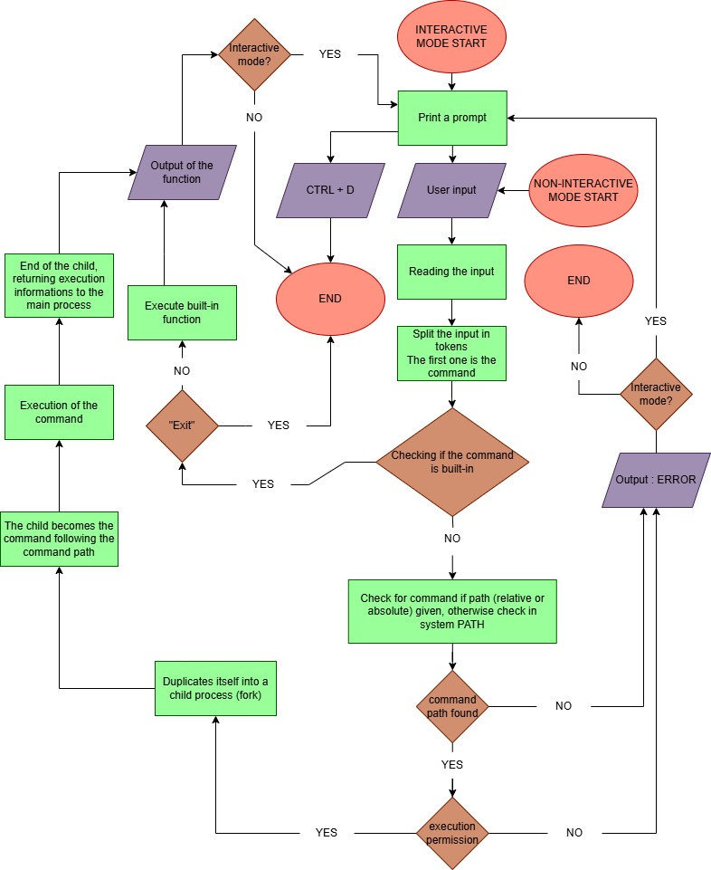

# `simple_shell` - Collaborative project in C

## Description
A pedagogical exercise in recreating a basic shell's essential mechanisms.
Part of the developer program at the Holberton School which follows a 
project-based learning approach.

## General information
`simple_shell` is a minimalist Unix command-line interpreter written in C. This
`simple_shell` attempts to emulate the behavior of `sh`, but ignores
command-line options and arguments. It has two modes of operation: interactive
and non-interactive. Interactive mode is the mode by default, it is initiated
by  executing  the `simple_shell` program. Non-interactive mode is entered when
commands piped into the standard input of `simple_shell`. 
+ In interactive mode, a prompt is displayed and the program awaits input from
the user.  Once a command is executed and an output (if any) is displayed, a new
prompt is displayed and a new input is awaited. To exit the interactive mode and
terminate the program two methods are available: `EOF`  emulation (`Ctrl+D`) and
the built-in command `exit`. 
+ In non-interactive mode, no prompt is made, the commands are executed, output 
(if any) is displayed, and the program terminates.
## Progression
Our shell can handle the commands existing in the "PATH" environment variable and the following built-ins : ```exit```, ```env```.

It could be improved by :
- Handling ```Ctrl+C```, the shell should not quit when it is used,
- Implementing more built-ins functions like ```setenv```, ```unsetenv```, ```cd```, ```help```, ```alias``` and ```history```,
- Handling the command separator ```;```,
- Handling the ```&&``` and ```||``` logical operators,
- Handling variable replacement,
- Handling ```$$``` and ```$?``` variables,
- Handling comments with ```#```,
- Handling files as input.

## Compilation Command
```gcc -Wall -Werror -Wextra -pedantic -std=gnu89 *.c -o simple_shell```

## Requirements
We have been required to make our code compilation--ready under systems with 
Ubuntu 20.04 LTS and using gcc as a compiler. Additionally, the compiler would
use the flags -Wall -Werror -Wextra -pedantic -std=gnu89 and all our codes must
follow the Betty coding style (which limits the length of our programs, among 
other things).
Moreover, we may not have more than 5 functions per file, all header files must
be include-guarded, and system calls must e used only when necessary.
The output and error output should be the same as those of ```sh``` in most
cases.

Team work, collaboration, and the methodology of equitative contributions were
strictly observed.

We were authorized to use only the following functions and system calls:
<table>
	<tr>
		<td>all functions from string.h</td>
		<td>getpid (man 2 getpid)</td>
		<td>readdir (man 3 readdir)</td>
	</tr>
	<tr>
		<td>access (man 2 access)</td>
		<td>isatty (man 3 isatty)</td>
		<td>signal (man 2 signal)</td>
	</tr>
	<tr>
		<td>chdir (man 2 chdir)</td>
		<td>kill (man 2 kill)</td>
		<td>stat (__xstat) (man 2 stat)</td>
	</tr>
	<tr>
		<td>close (man 2 close)</td>
		<td>malloc (man 3 malloc)</td>
		<td>lstat (__lxstat) (man 2 lstat)</td>
	</tr>
	<tr>
		<td>closedir (man 3 closedir)</td>
		<td>open (man 2 open)</td>
		<td>fstat (__fxstat) (man 2 fstat)</td>
	</tr>
	<tr>
		<td>execve (man 2 execve)</td>
		<td>opendir (man 3 opendir)</td>
		<td>strtok (man 3 strtok)</td>
	</tr>
	<tr>
		<td>exit (man 3 exit)</td>
		<td>perror (man 3 perror)</td>
		<td>wait (man 2 wait)</td>
	</tr>
	<tr>
		<td>_exit (man 2 _exit)</td>
		<td>printf (man 3 printf)</td>
		<td>waitpid (man 2 waitpid)</td>
	</tr>
	<tr>
		<td>fflush (man 3 fflush)</td>
		<td>fprintf (man 3 fprintf)</td>
		<td>wait3 (man 2 wait3)</td>
	</tr>
	<tr>
		<td>fork (man 2 fork)</td>
		<td>vfprintf (man 3 vfprintf)</td>
		<td>wait4 (man 2 wait4)</td>
	</tr>
	<tr>
		<td>free (man 3 free)</td>
		<td>sprintf (man 3 sprintf)</td>
		<td>write (man 2 write)</td>
	</tr>
	<tr>
		<td>getcwd (man 3 getcwd)</td>
		<td>putchar (man 3 putchar)</td>
	</tr>
	<tr>
		<td>getline (man 3 getline)</td>
		<td>read (man 2 read)</td>
	</tr>
</table>

## Usage/Examples
Here are some examples of the use of our shell :

```
valentin@Valou-PC:~/holbertonschool-simple_shell$ ./simple_shell
$ ls
README.md  Shared_diagram-VD.jpg  VD_tests  builtin.c  exec.c  generate-authors.sh  helper.c  hsh  main.c  path.c  read.c  shell  shell.h  split.c
$ pwd
/home/valentin/holbertonschool-simple_shell
$ exit
valentin@Valou-PC:~/holbertonschool-simple_shell$
```

## Man page
The man page provides a detailed explanation of the function. To see the full
documentation, read our man page by doing : 
```man ./man_1_simple_shell``` while in the same directory.

## Testing
We have made a testing program to test different cases of command and error code handling.
Here are some examples of output from the test:

```
Command: unknowcmd
Expected exit: 127 | Got: 127
Expected output (part): "not found"
Shell output:
./simple_shell: 1: unknowcmd: not found

TEST ✅ PASSED

Command: ls /doesnotexist
Expected exit: 2 | Got: 2
Expected output (part): "No such file or directory"
Shell output:
ls: cannot access '/doesnotexist': No such file or directory

TEST ✅ PASSED

Command: exit
Expected exit: 0 | Got: 0
Expected output (part): ""
Shell output:

TEST ✅ PASSED
```

We also used valgrind to be sure there are no memory leaks :
```valgrind ./simple_shell```

## Flowchart
We have made a flowchart to facilitate the comprehension of our algorithm :


## Required files
- `main.c` : entry point, core of the program.
- `shell.h` : header file containing all library inclusions as well as all the 
	function prototypes, and structures used by `simple_shell`.
- `read.c` : file containing the function to read user's input.
- `split.c` : contains the function that tokenize the input, such that the first
	token (of each read line) may be used as a command and the rest as that
	commands options.
- `builtin.c` : contains the built-in functions and another that checks if the
	used command is part of the available builti-in's. 
- `helper.c` : contains some helper functions for the functions who offer actual
	program functionalities.
- `exec.c` : contains the function that handles command execution.
- `path.c` : contains the function that finds the command in the system PATH
	(when the command was not given as a path to the executable).

## Authors
* Valentin Dumont : [github.com/Proser-V](https://github.com/Proser-V)
* Hamza Hammadi : [github.com/Hamza-coder3011](https://github.com/Hamza-coder3011)
* Xavier Laforgue : [github.com/XavierLaforgue](https://github.com/XavierLaforgue)
